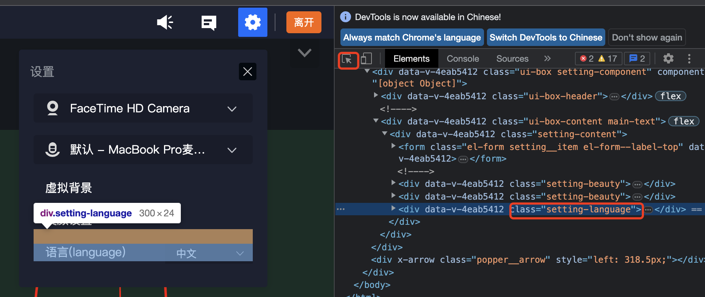
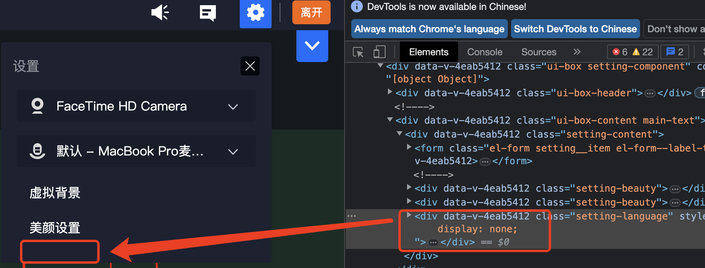

# pure css

use css file to config in tencent cloud console ,update custom ui of style file url.

## example



```css
/* css file content */
/*
* 隐藏语言选择 
* hide language select
*/
.setting-language {
    display: none;
}
```




## how to update

1、find dom class or id 
    update online css in chorme devtools , for example:
    
    ```css
    #id { color: #fff; }
    ```

2、save update css  to custom css as a new file
    save css as new file,
    use new css to overrite origin page css
    eg: [custom.css](./custom.css)

3、config to console
    
    https://cloud.tencent.com/document/product/1639/90204

    if use default sence not need to add url params to class room url,
    otherwise add `&sence={sence param name}` to visit url
    

4、view in classRoom
    visit url like:
    https://class.qcloudclass.com/1.7.3/class.html?classid=xxx&userid=xx&token=xxx&sence=xxx

more detail visit: https://cloud.tencent.com/document/product/1639/79896


## more 

more css struct like [theme.css](./theme.css)
