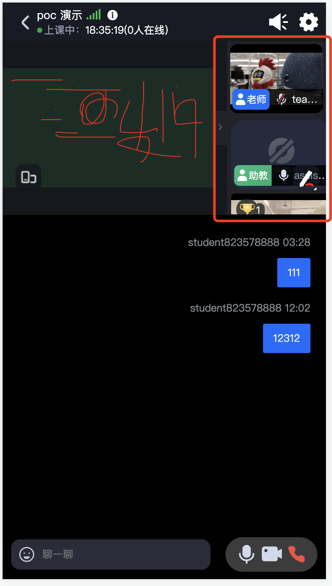
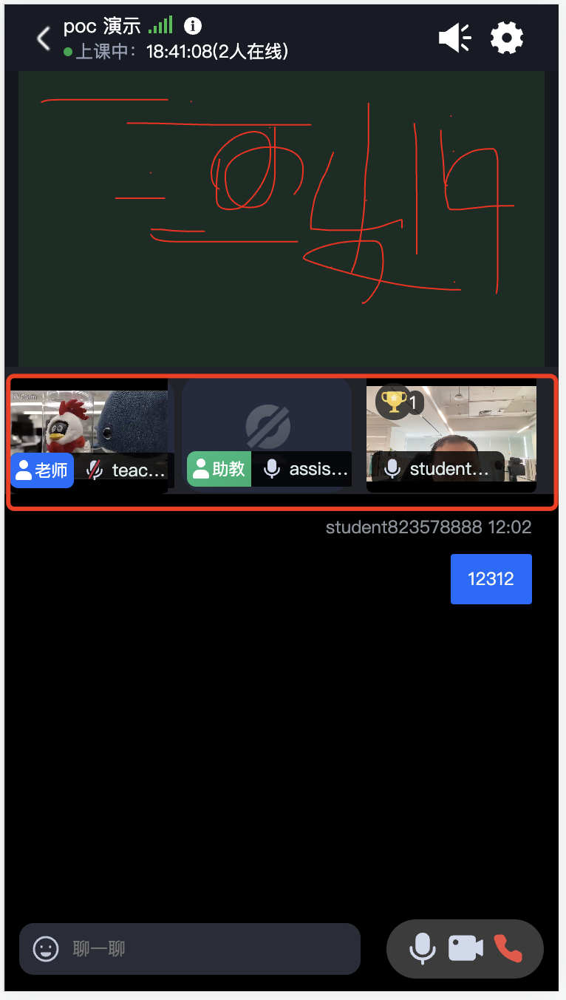

# js + css

use js file and css file to config in tencent cloud console ,update custom ui of style file url.

we use css to update layout ,use js to set Dynamic width and height of Dom nodes

我们使用css 来调整样式与布局，
通过js 来动态调整dom 节点属性

